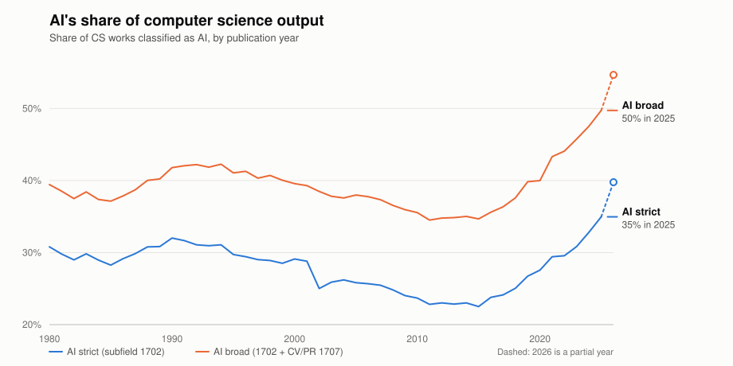
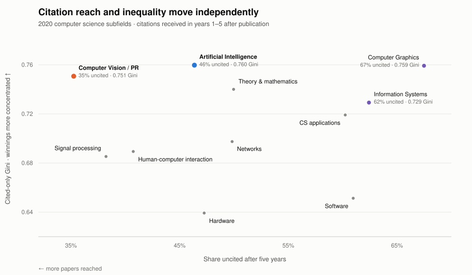
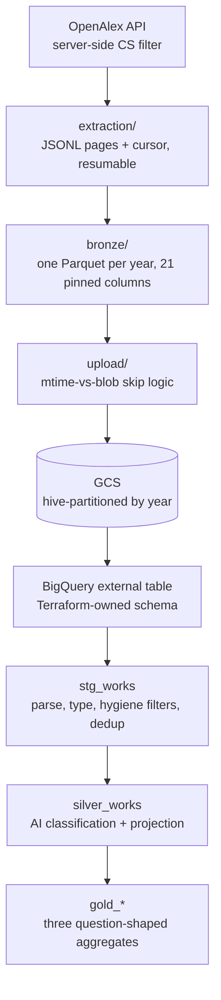

# openalex-pipeline

An end-to-end analytical pipeline over **14.7 million computer science papers**
from [OpenAlex](https://openalex.org), built to answer three questions about how
AI research grew and how its citations are distributed.

Extraction and transformation are Python; the warehouse is BigQuery via dbt;
orchestration is Dagster; infrastructure is Terraform. The headline result is
that AI's share of CS output is at an all-time high after a decade-long slump —
and that AI's citation economy is more top-heavy than the field average in a
specific, narrower sense than the obvious measure suggests.

---

## Findings

### Q1 — AI's share of CS output is at an all-time high, and the path is not monotone

<picture>
  <source media="(prefers-color-scheme: dark)" srcset="assets/q1-ai-share-dark.svg">
  
</picture>

Roughly 31% of CS works in 1980 were AI, sliding to a trough near 23% around
2012, then climbing to ~35% in 2025; the broad sensitivity series follows the
same shape. Strict AI is pinned to OpenAlex subfield 1702, while broad AI adds
computer vision and pattern recognition (1707). Because OpenAlex assigns topics
retroactively, the history shows how today's taxonomy sees earlier research,
not how each era saw itself; the dashed 2026 endpoint is partial data.

### Q2 — By 2025, half of citation attention went to work no more than five years old

<!-- prettier-ignore -->
| Cited-work group | Median age, 2012 → 2025 | 2025 citations to work ≤5 years old |
|---|---:|---:|
| AI | 8 → 5 years | 55.4% |
| Computer Vision & PR | 7 → 5 years | 57.2% |
| Rest of CS | 7 → 5 years | 54.3% |

Citation attention shifted toward younger work across computer science: median
cited-work age fell from seven or eight years in 2012 to five years in every
group by 2025, with CV/PR reaching that point first in 2018. This is a fixed
snapshot through citation year 2025 and classifies the work being cited—not the
unknown citing work—so it does not show what AI-authored papers cite or prove
that research is becoming intrinsically obsolete faster.

### Q3 — AI combines broad citation reach with winner-take-most outcomes

<picture>
  <source media="(prefers-color-scheme: dark)" srcset="assets/q3-citation-concentration-dark.svg">
  
</picture>

Five years after publication, 46% of the 2020 AI cohort remained uncited while
citations among the papers that were reached had the highest cited-only Gini in
CS, 0.760; CV/PR paired an even lower uncited rate of 35% with similarly high
inequality. That pairing—not unusually high overall concentration—is the
result: AI ranks only 3rd–5th of 11 on the all-paper Gini, and pooled “rest of
CS” is not a like-for-like comparator because mixing subfields introduces
additional between-subfield inequality. The pattern also hardened from 2012 to
2020 as AI's cited-only Gini rose from 0.684 to 0.760 while its uncited rate fell
from 57.6% to 46.4%.

Full results, reconciliation baselines, and the bounds every number was computed
under: [`FINDINGS.md`](FINDINGS.md). Design rationale and rejected alternatives:
[`DECISIONS.md`](DECISIONS.md).

---

## Architecture



Every stage is a standalone CLI as well as a Dagster asset, so any layer can be
run and debugged on its own.

**The pipeline keeps its state on the filesystem.** File presence and atomic
rename are the completion signals — there is no separate state store to fall out
of sync with reality. A year shard moves `FRESH → IN_PROGRESS → COMPLETE`, and
any file combination that doesn't correspond to a legal state raises rather than
attempting recovery.

**Each layer does exactly one job.** Bronze parses nothing nested and types no
dates; staging classifies nothing; silver aggregates nothing. The boundaries are
enforced by import discipline and stated in the module docstrings.

**Orchestration is convergence-based, not schedule-based.** A daily job sweeps
local extraction and upload; the warehouse build is driven by a sensor that
fires only when local and cloud state have actually converged and the warehouse
is genuinely stale — not on a timer that hopes the data is ready.

---

## Engineering notes

- **The bronze schema is declared in three places and pinned in all of them** —
  the Polars schema, the Terraform external-table definition, and the dbt
  staging model. A test parses the Terraform file and asserts it agrees with the
  Python schema on names, order, types, and nullability, because those two can
  drift silently. The dbt leg fails loudly on its own.
- **Schemas are imposed, never inferred.** A non-conforming value is an error at
  ingest, not a surprise three layers downstream.
- **Corruption is loud.** Known failure modes get typed exceptions; unknown ones
  propagate untouched. No silent recovery anywhere in the pipeline.
- **Costs are capped in the profile**, not by convention: 100 GiB maximum billed
  bytes per job, with `dev` as the default target so a bare `dbt build` can never
  touch production.
- **No credentials on disk.** GCP auth is application-default credentials
  impersonating a dedicated service account, mirroring the Terraform IAM setup.
- **Verification is heavy where it matters**: 255 Python tests with no network
  and no cloud calls (the HTTP connector and GCS bucket are injected seams),
  plus 116 dbt data tests and 25 singular reconciliation tests that check
  cross-grain agreement, cohort floors, and identity constraints on the
  published aggregates. Ablation variants and sensitivity analyses are run and
  recorded rather than assumed.
- **CI** runs ruff, pyright, pytest, a dbt parse, and a Dagster definitions
  validation on every push and pull request — no cloud credentials required.

---

## Running it

Requires Python 3.12+, [`uv`](https://docs.astral.sh/uv/), and — for the
warehouse stages — a GCP project with application-default credentials.

```bash
uv sync
cp .env.example .env      # then fill it in

uv run python -m openalex_pipeline.extraction   # API → JSONL (resumable, daily-limit aware)
uv run python -m openalex_pipeline.bronze       # JSONL → Parquet + manifest
uv run python -m openalex_pipeline.upload       # Parquet → GCS + manifest
uv run dbt build --project-dir dbt              # target defaults to dev
```

`uv run dagster dev` starts the orchestration UI — note that it also starts the
production automation, since all schedules and sensors default to running.

Infrastructure (bucket, datasets, external table, IAM) lives in `terraform/`.

To regenerate the README charts from their committed gold extracts:

```bash
uv run python tools/render_q1_chart.py
uv run python tools/render_q3_chart.py
```

---

## Limitations

- **Q2 and Q3 freshness is not automated.** The monthly refresh updates the
  current publication year; it does not extend historical citation windows or
  re-run classification. Both are full-corpus analytical snapshots, and
  advancing their ranges is a deliberate manual operation.
- **Year rollover is manual**, requiring coordinated changes to extraction
  bounds and dbt variables. The three year-bound families advance
  independently and only after a full reconciliation.
- **Q3's earliest cohorts may become unrebuildable.** OpenAlex's per-year
  citation counts are a rolling window, so a future re-extraction may drop the
  earliest citation years. No mitigation is in place.
- **The most recent cohort carries a settling caveat** that a single snapshot
  cannot fully resolve, though the diagnostics run against it point away from
  under-indexing rather than toward it.
- A **Streamlit dashboard** over the gold models is the remaining layer.

---

## Repository map

<!-- prettier-ignore -->
| Path | Contents |
|---|---|
| `src/openalex_pipeline/` | extraction, bronze, upload, orchestration |
| `dbt/` | staging, silver, and gold models; data and singular tests |
| `terraform/` | GCS bucket, BigQuery datasets, external table, IAM |
| `tests/` | Python test suite, mirroring package structure |
| `assets/` | README charts and the gold extracts they render from |
| `docs/` | design archive, vendored OpenAlex docs |
| `OVERVIEW.md` | architecture, contracts, and boundaries in depth |
| `DECISIONS.md` | design rationale and rejected alternatives |
| `FINDINGS.md` | full results with the bounds they were computed under |
