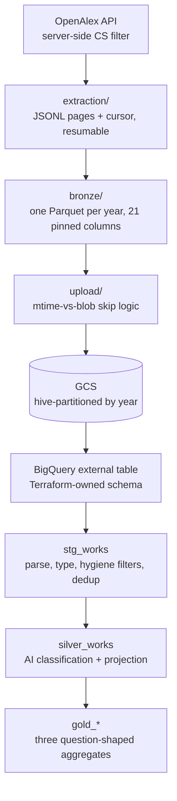

# openalex-pipeline

An end-to-end analytical pipeline over **14.7 million computer science papers**
from [OpenAlex](https://openalex.org), built to answer three questions about how
AI research grew and how its citations are distributed.

Extraction and transformation are Python; the warehouse is BigQuery via dbt;
orchestration is Dagster; infrastructure is Terraform. The headline result is
that AI's share of CS output is at an all-time high after a decade-long slump —
and that AI's citation economy is more top-heavy than the field average in a
specific, narrower sense than the obvious measure suggests.

---

## Findings

### Q1 — AI's share of CS output is at an all-time high, and the path is not monotone

<picture>
  <source media="(prefers-color-scheme: dark)" srcset="assets/q1-ai-share-dark.svg">
  
</picture>

Roughly 31% of CS works in 1980 were AI, sliding to a trough near 23% around
2012, then climbing to ~35% in 2025. The dip-and-surge shape lines up with the
qualitative "AI winter" narrative.

"AI" is pinned by **stable OpenAlex subfield id, never display name** — strict is
subfield 1702; broad adds computer vision and pattern recognition (1707). Every
downstream model carries both, so each result has a built-in sensitivity check
rather than a single contestable definition.

**The caveat that travels with this result:** OpenAlex assigns topics
retroactively using a modern taxonomy. That is what makes a 1980 "AI share"
well-defined at all, and it means the series measures *how today's taxonomy sees
1980*, not how 1980 saw itself.

### Q2 — Citation attention has shifted toward younger work

Median age of cited work fell from 8 years (2012) to 5 years (2025) across all
of computer science, with computer vision consistently the most recent-leaning —
it reached a median of 5 years back in 2018. By 2025, over half of all citation
events went to work published within the previous five years.

This measures the ages of *cited* works. It is not evidence about what
AI-authored papers cite, and not proof of faster intrinsic obsolescence.

### Q3 — Citation impact in AI is a winner's game

The usual measure of citation inequality — a Gini coefficient over all papers —
conflates two different things: how many papers are *never* cited, and how
unequally the cited ones share the winnings. Separating them reorders the field.

Among 2020-cohort papers measured over five complete years, AI has the **highest
cited-only Gini in computer science**, and computer vision the third. What
distinguishes them is the *pairing*: both combine that concentration with among
the **lowest uncited rates** in the field. AI papers get cited more often than
average, and the winnings still pool at the top.

The contrast makes the point. Computer graphics has a nearly identical
cited-only Gini but more than twice the uncited rate — a different phenomenon
wearing the same number. Information systems tops the all-papers Gini purely
because 62% of its papers are never cited at all.

This is also hardening over time: across the 2012 → 2020 cohorts, AI's
cited-only Gini rose while its uncited rate fell.

### What the data didn't support

The original conjecture was that AI is simply more citation-concentrated than
the rest of computer science. **It isn't.** On the pooled AI-versus-rest view the
all-papers Gini gap runs slightly the *other* way for most cohorts, and AI is
never the most concentrated CS subfield — it ranks 3rd–5th of 11 in every cohort
at both measurement windows. Information systems holds the maximum throughout.

The surviving claim is narrower and better: the distinction is not *how*
concentrated AI is overall, but that it combines high concentration among cited
papers with an unusually low share of papers that go uncited.

One structural finding fell out of testing this. Pooled "rest of CS" Gini
consistently exceeds the mean of individual subfield Ginis, because pooling
heterogeneous subfields adds between-subfield inequality that no single subfield
carries. So the pooled and per-subfield views are **two relations at different
grains, not one filterable table** — a distinction the models enforce and any
consumer of them has to respect.

Full results, reconciliation baselines, and the bounds every number was computed
under: [`FINDINGS.md`](FINDINGS.md). Design rationale and rejected alternatives:
[`DECISIONS.md`](DECISIONS.md).

---

## Architecture



Every stage is a standalone CLI as well as a Dagster asset, so any layer can be
run and debugged on its own.

**The pipeline keeps its state on the filesystem.** File presence and atomic
rename are the completion signals — there is no separate state store to fall out
of sync with reality. A year shard moves `FRESH → IN_PROGRESS → COMPLETE`, and
any file combination that doesn't correspond to a legal state raises rather than
attempting recovery.

**Each layer does exactly one job.** Bronze parses nothing nested and types no
dates; staging classifies nothing; silver aggregates nothing. The boundaries are
enforced by import discipline and stated in the module docstrings.

**Orchestration is convergence-based, not schedule-based.** A daily job sweeps
local extraction and upload; the warehouse build is driven by a sensor that
fires only when local and cloud state have actually converged and the warehouse
is genuinely stale — not on a timer that hopes the data is ready.

---

## Engineering notes

- **The bronze schema is declared in three places and pinned in all of them** —
  the Polars schema, the Terraform external-table definition, and the dbt
  staging model. A test parses the Terraform file and asserts it agrees with the
  Python schema on names, order, types, and nullability, because those two can
  drift silently. The dbt leg fails loudly on its own.
- **Schemas are imposed, never inferred.** A non-conforming value is an error at
  ingest, not a surprise three layers downstream.
- **Corruption is loud.** Known failure modes get typed exceptions; unknown ones
  propagate untouched. No silent recovery anywhere in the pipeline.
- **Costs are capped in the profile**, not by convention: 100 GiB maximum billed
  bytes per job, with `dev` as the default target so a bare `dbt build` can never
  touch production.
- **No credentials on disk.** GCP auth is application-default credentials
  impersonating a dedicated service account, mirroring the Terraform IAM setup.
- **Verification is heavy where it matters**: 255 Python tests with no network
  and no cloud calls (the HTTP connector and GCS bucket are injected seams),
  plus 116 dbt data tests and 25 singular reconciliation tests that check
  cross-grain agreement, cohort floors, and identity constraints on the
  published aggregates. Ablation variants and sensitivity analyses are run and
  recorded rather than assumed.
- **CI** runs ruff, pyright, pytest, a dbt parse, and a Dagster definitions
  validation on every push and pull request — no cloud credentials required.

---

## Running it

Requires Python 3.12+, [`uv`](https://docs.astral.sh/uv/), and — for the
warehouse stages — a GCP project with application-default credentials.

```bash
uv sync
cp .env.example .env      # then fill it in

uv run python -m openalex_pipeline.extraction   # API → JSONL (resumable, daily-limit aware)
uv run python -m openalex_pipeline.bronze       # JSONL → Parquet + manifest
uv run python -m openalex_pipeline.upload       # Parquet → GCS + manifest
uv run dbt build --project-dir dbt              # target defaults to dev
```

`uv run dagster dev` starts the orchestration UI — note that it also starts the
production automation, since all schedules and sensors default to running.

Infrastructure (bucket, datasets, external table, IAM) lives in `terraform/`.

To regenerate the Q1 chart from the committed gold extract:

```bash
uv run python tools/render_q1_chart.py
```

---

## Limitations

- **Q2 and Q3 freshness is not automated.** The monthly refresh updates the
  current publication year; it does not extend historical citation windows or
  re-run classification. Both are full-corpus analytical snapshots, and
  advancing their ranges is a deliberate manual operation.
- **Year rollover is manual**, requiring coordinated changes to extraction
  bounds and dbt variables. The three year-bound families advance
  independently and only after a full reconciliation.
- **Q3's earliest cohorts may become unrebuildable.** OpenAlex's per-year
  citation counts are a rolling window, so a future re-extraction may drop the
  earliest citation years. No mitigation is in place.
- **The most recent cohort carries a settling caveat** that a single snapshot
  cannot fully resolve, though the diagnostics run against it point away from
  under-indexing rather than toward it.
- A **Streamlit dashboard** over the gold models is the remaining layer.

---

## Repository map

<!-- prettier-ignore -->
| Path | Contents |
|---|---|
| `src/openalex_pipeline/` | extraction, bronze, upload, orchestration |
| `dbt/` | staging, silver, and gold models; data and singular tests |
| `terraform/` | GCS bucket, BigQuery datasets, external table, IAM |
| `tests/` | Python test suite, mirroring package structure |
| `assets/` | README chart, and the gold extract it renders from |
| `docs/` | design archive, vendored OpenAlex docs |
| `OVERVIEW.md` | architecture, contracts, and boundaries in depth |
| `DECISIONS.md` | design rationale and rejected alternatives |
| `FINDINGS.md` | full results with the bounds they were computed under |
