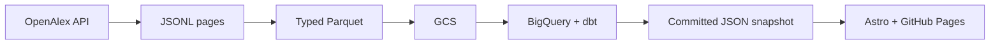

# AI in computer-science research

A data pipeline and visual essay exploring AI's place in **14.7 million
computer-science works** from OpenAlex. The project follows the data from a
paginated API through a tested analytical warehouse to a static website with
three questions: how much of CS is AI, how old is the work receiving citations,
and how concentrated are those citations?

**[Read the visual essay →](https://ngolombiewski.github.io/openalex-pipeline/)**

Python · Polars · GCS · BigQuery · dbt · Dagster · Terraform · Astro · Observable Plot

## What the data shows

The corpus contains works whose primary topic belongs to computer science,
after filtering and deduplication. It covers **1950–2026, with 2026 partial**;
citation analyses end in **2025**. The website uses a frozen export, so these
results do not change when the pipeline runs.

- **AI's share has grown since its mid-2010s trough.** AI alone accounts for
  35.0% of CS works in 2025; including computer vision and pattern recognition
  brings that to 49.7%. Classification uses OpenAlex's modern taxonomy applied
  retroactively to earlier work.
- **Citation attention has moved toward younger work.** From 2012 to 2025,
  the citation-weighted median age falls from eight to five years for AI and
  from seven to five for both CV/PR and the rest of CS. Groups describe the
  work receiving citations; they do not tell us what AI-authored papers cite.
- **Broad citation reach can coexist with concentrated rewards.** Among CS
  subfields, AI and CV/PR combine relatively low uncited shares with high
  inequality among cited papers. This comparison follows the 2020 publication
  cohort through calendar years 2021–2025, excluding publication-year
  citations. “Uncited” means no citations in that window, and its final year
  may still be settling.

The visual essay includes the charts, detailed values, methods, and snapshot
provenance. The committed snapshot was exported on **1 October 2026**; that is
the date results were copied from the warehouse, not a source refresh date.

## From API to publication


```mermaid
flowchart LR
    API[OpenAlex API] --> JSONL[JSONL pages]
    JSONL --> PQ[Typed Parquet]
    PQ --> GCS[GCS]
    GCS --> BQ[BigQuery + dbt]
    BQ --> SNAP[Committed JSON snapshot]
    SNAP --> SITE[Astro + GitHub Pages]
```

[Python runners](src/openalex_pipeline/) extract one publication year at a time,
resume interrupted pagination, convert completed years to Parquet, and replace
missing or older GCS objects. [dbt](dbt/models/) parses and deduplicates records in staging,
classifies works in silver, and builds four gold tables for the three analyses.
[Terraform](terraform/) defines the bucket, warehouse datasets, external source
table, and IAM.

[Dagster](src/openalex_pipeline/orchestration/definitions.py) runs a daily local
sweep and requests a monthly refresh of the configured latest publication year.
A sensor starts a warehouse build once local and cloud artifacts converge and
the warehouse is stale. The [snapshot exporter](tools/export_dashboard_snapshot.py)
is a separate manual step. The [dashboard](dashboard/) builds entirely from
committed files; publication deploys the data and narrative from one selected
commit.

## Design choices that matter

**Artifacts carry pipeline state.** Completion reports and Parquet files tell
each runner what is finished. Manifests are rebuilt from artifacts, and Dagster
history is not needed to resume ingestion. Page writes precede cursor updates;
refresh requests persist until their invalidation sequence completes.

**Each layer has a narrow contract.** Bronze pins scalar types and preserves
nested values as JSON strings. Staging owns parsing, filtering, and
deduplication; silver owns classification; gold owns aggregation. Schema mirror
tests check the Python/Terraform boundary. Known corruption raises typed errors
rather than prompting an inferred repair.

**The analytical definitions are tested.** dbt tests check weighted citation
ages, fixed observation windows, zero-citation denominators, and reconciliation
across output grains. AI and CV/PR remain separate groups for medians and
concentration: those measures cannot be combined by averaging group results.

**Publication is reproducible from the committed snapshot.** Site builds need
no cloud credentials or running pipeline. They validate the data boundary and
check that the snapshot still supports the authored claims. A new export that
contradicts the story fails the build for content review. Website releases are
manual and select a full commit SHA.

## Run locally

### Preview the visual essay

Requires Node.js 24; the exact version is pinned in
[`dashboard/.node-version`](dashboard/.node-version). From the repository root:

```sh
cd dashboard
npm ci
npm run dev
```

Open the address printed by Astro, including the `/openalex-pipeline/` base
path. All data is included in the repository. To check the site and produce the
static build:

```sh
npm run check
npm test
npm run build
```

### Check the pipeline

Requires Python 3.12+ and `uv`. From the repository root, in a Bash-compatible
shell:

```sh
uv sync --locked
uv run ruff check .
uv run ruff format --check .
uv run pyright

(
  export OPENALEX_GCP_PROJECT=ci-placeholder-project
  export DBT_PROFILES_DIR=dbt
  export DBT_LOG_PATH=dbt/logs
  uv run dbt deps --project-dir dbt
  uv run pytest -q
  uv run dbt parse --project-dir dbt
  uv run dagster definitions validate
)
```

Dependency installation needs network access; these checks need no OpenAlex or
GCP credentials. The subshell confines the placeholder project to validation.
Definitions validation prepares the dbt manifest without starting automation.
Warehouse data tests and dbt fixture unit tests run separately in BigQuery
through `dbt build`.

<details>
<summary><strong>Run ingestion and a development warehouse build</strong></summary>

The cloud path requires an OpenAlex API key, Google Application Default
Credentials, and provisioned GCS/BigQuery resources. Infrastructure and dbt
profiles contain project-specific bucket names and impersonation identities;
adapt them for your deployment. Changing the project environment variable alone
is insufficient. Terraform's backend bucket and runner identity must exist
before backend initialization.

Copy `.env.example` to `.env` and fill the required values. The analytical
corpus uses:

```dotenv
OPENALEX_FILTER=primary_topic.field.id:17
OPENALEX_START_YEAR=1950
OPENALEX_END_YEAR=2026
```

Set the data root, bucket, project, and API key as well. With direnv and its shell
hook installed, review `.envrc` and run `direnv allow` to export the environment
and prepare the local Dagster instance. Only extraction settings load `.env`
automatically; the standalone bronze and upload CLIs need process environment.
Upload uses ADC directly; dbt impersonates the service account in its profile.

Run extraction until all configured years are complete. A daily-limit stop is
an expected partial outcome; rerun later to resume.

```sh
uv run python -m openalex_pipeline.extraction
```

Then convert, upload, and build the development slice:

```sh
uv run python -m openalex_pipeline.bronze
uv run python -m openalex_pipeline.upload
uv run dbt deps --project-dir dbt
uv run dbt build --project-dir dbt --target dev \
  --vars '{year_min: 2012, year_max: 2016}'
```

`dev` selects a destination dataset. Without the explicit year override, it
still reads the default 1950–2026 corpus. Both targets cap each query at 100 GiB
billed; this is not a total spending limit. The reduced slice is useful for
structural checks, but omits older cited works needed to reproduce Q2.

**Starting Dagster activates production automation.** Both schedules and the
sensor default to running, and the warehouse job targets prod. Start
`uv run dagster dev` only when that is intended. Standalone CLIs do not acquire
the orchestration lock; keep manual pipeline runs separate from automation.

</details>

## Scope and limits

The corpus is defined by OpenAlex's primary-topic classification. Works outside
that definition are outside the analysis; retracted works, paratext, unknown
exclusion statuses, and duplicate IDs are removed in staging.

Monthly refresh updates only the configured latest publication year. Historical
citation analyses need an explicit full-corpus refresh and reconciliation.
OpenAlex's rolling citation history can also make the earliest cohorts
unrebuildable from a later extraction. The committed aggregates preserve the
published results, not all source records needed to reproduce them.

Operational freshness uses file and object timestamps rather than content
hashes, and there is no transaction spanning all years and warehouse tables.
The pipeline supports resumption and diagnoses inconsistent states; some
interrupted writes still require investigation.
