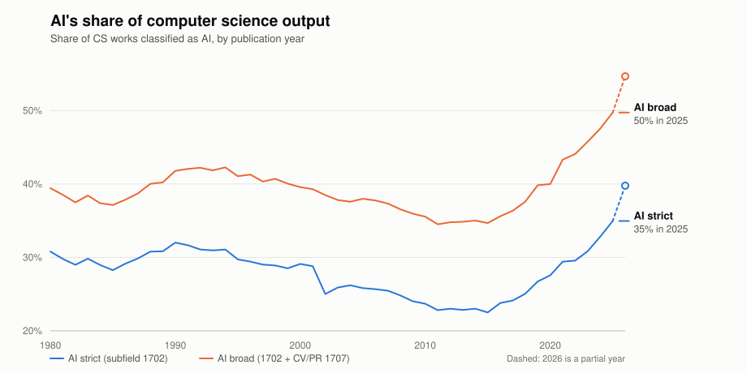
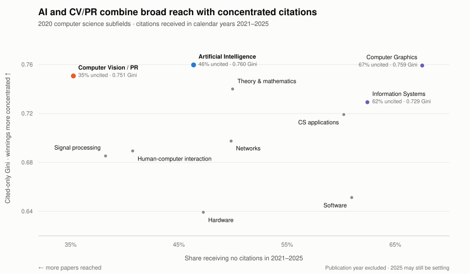
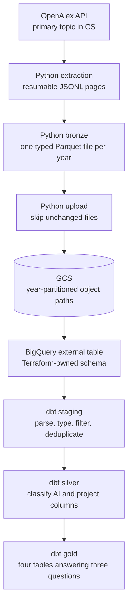

# openalex-pipeline

An analytical pipeline over **14.7 million OpenAlex works whose primary topic
belongs to computer science**, after filtering and deduplication. It measures
AI's share of research output, the age of work receiving citations, and how
unevenly those citations are distributed.

The corpus covers publication years **1950–2026, with 2026 partial**. Citation
analyses end in **2025**. The findings below describe the July 2026 warehouse
snapshot, checked again in September 2026; they are not live indicators.

Python handles extraction and local landing, dbt SQL builds the BigQuery
warehouse, Dagster orchestrates the stages, and Terraform manages the cloud
infrastructure. **The pipeline is complete through gold.** A
[Streamlit dashboard](docs/dashboard-spec.md) is planned.

## Findings

### Q1 — AI's share has risen sharply since its mid-2010s trough

<picture>
  <source media="(prefers-color-scheme: dark)" srcset="assets/q1-ai-share-dark.svg">
  
</picture>

Strict AI's share fell from **30.8% in 1980** to **22.5% in 2015**, then rose to
**35.0% in 2025**. Broad AI, which also includes computer vision and pattern
recognition, reached **49.7% in 2025**.

Partial 2026 shares are higher still: **39.8% strict** and **54.7% broad**, the
highest values in the loaded 1950–2026 history. Complete-year records differ:
broad AI sets one in 2025, while strict AI's 2025 share remains slightly below
its **35.3% in 1951**. Partial-year ratios are provisional.

Strict AI is OpenAlex subfield 1702; broad AI adds subfield 1707. Classification
uses each work's primary topic. OpenAlex assigns topics retroactively, so this
series shows how today's taxonomy classifies earlier research. It does not
reconstruct how researchers classified their work at the time.

[Full Q1 series, including years before the chart](assets/q1_ai_share_by_year.csv).

### Q2 — More than half of 2025 citations went to work of calendar age five or less

<!-- prettier-ignore -->
| Cited-work group | Median calendar age, 2012 → 2025 | 2025 citations received at ages 0–5 |
|---|---:|---:|
| AI | 8 → 5 years | 55.4% |
| Computer Vision & PR | 7 → 5 years | 57.2% |
| Rest of CS | 7 → 5 years | 54.3% |

Median cited-work age fell from seven or eight years in 2012 to five years in
every group by 2025. CV/PR reached that median first, in 2018. Each citation
counts as one observation: a work receiving 100 citations contributes 100
observations at its age. Calendar age is citation year minus publication year;
the 0–5 range includes citations received during the publication year.

This snapshot classifies the **work receiving the citation**. It cannot tell us
what AI-authored papers cite, and younger citation attention alone does not
establish faster intrinsic obsolescence.

### Q3 — AI combines broad citation reach with concentrated citations

<picture>
  <source media="(prefers-color-scheme: dark)" srcset="assets/q3-citation-concentration-dark.svg">
  
</picture>

For works published in **2020**, the comparison counts citations received in
**calendar years 2021–2025**. It excludes publication-year citations. A work
with no citations in this window may still have received citations in 2020;
these are five complete calendar years, not each work's first five years of
life. The terminal citation year, 2025, may still be settling.

<!-- prettier-ignore -->
| Subfield | No citations in 2021–2025 | Gini, all works | Gini, cited works only |
|---|---:|---:|---:|
| Artificial Intelligence | 46.4% | 0.871 | 0.760 |
| Computer Vision & PR | 35.3% | 0.839 | 0.751 |
| Computer Graphics & CAD | 67.5% | 0.922 | 0.759 |
| Information Systems | 62.4% | 0.898 | 0.729 |

Gini measures inequality: zero means equal citation counts, and values toward
one indicate greater concentration. The all-work measure includes works with
no window citations; the cited-only measure describes inequality among those
receiving at least one.

AI has the highest cited-only Gini of the 11 CS subfields in this cell, while
CV/PR ranks third. Their shares receiving no window citations are the
fourth-lowest and lowest respectively. The **top 5% of all works in the AI
cohort receive 64.7% of its window citations**. AI's all-work Gini ranks fourth:
the combination of reach and concentration among cited works is the finding.

At the same five-year window, AI's cited-only Gini rises from **0.684 for the
2012 cohort to 0.760 for 2020**, while its share receiving no window citations
falls from **57.6% to 46.4%**. Comparisons with pooled "rest of CS" answer a
different question: pooling heterogeneous subfields introduces between-subfield
inequality, so its Gini is not an average of individual subfield Ginis.

[All 11 subfields in the chart](assets/q3_citation_concentration_2020_age5.csv).
Full results, analytical bounds, and reconciliation evidence are in
[`FINDINGS.md`](FINDINGS.md).

## Architecture


```mermaid
flowchart TD
    API[OpenAlex API<br/>primary topic in CS] --> EX
    EX[Python extraction<br/>resumable JSONL pages] --> BR
    BR[Python bronze<br/>one typed Parquet file per year] --> UP
    UP[Python upload<br/>skip unchanged files] --> GCS
    GCS[(GCS<br/>year-partitioned object paths)] --> EXT
    EXT[BigQuery external table<br/>Terraform-owned schema] --> STG
    STG[dbt staging<br/>parse, type, filter, deduplicate] --> SIL
    SIL[dbt silver<br/>classify AI and project columns] --> GOLD
    GOLD[dbt gold<br/>four tables answering three questions]
```

Extraction, bronze, and upload each have a standalone Python CLI and a Dagster
asset. Warehouse models run through dbt, directly or through Dagster.

**Completion is recorded on disk.** Extraction shards move through
`FRESH → IN_PROGRESS → COMPLETE`; atomic file writes and completion reports
make interrupted runs resumable. Manifests are derived from local files and
cloud object metadata. Dagster's run history is advisory rather than the source
of pipeline completion state.

**The layers have explicit boundaries.** Bronze imposes scalar types and keeps
nested values as JSON strings. Staging parses nested fields and dates, removes
retracted/paratext records and records with unknown exclusion status, and
deduplicates. Silver classifies and projects; gold aggregates.

**Scheduled ingestion feeds a readiness-gated warehouse build.** A daily sweep
extracts, converts, and uploads; a monthly request refreshes the configured
latest publication year. A sensor requests a warehouse build only after local
and cloud state converge and the warehouse needs refreshing.

## Engineering guarantees and checks

- **Pinned schemas.** Bronze, the external table, and staging declare their
  schemas explicitly. A test checks the Python and Terraform declarations for
  agreement. Nested/date parsing is deferred to staging and checked there.
- **Explicit failures.** Known corruption raises typed exceptions; unknown
  failures propagate. The pipeline does not silently repair inconsistent state.
- **Bounded individual queries.** Both dbt targets set a 100 GiB per-job billed
  bytes limit. This is not a cumulative budget. The default target is `dev`;
  publication-year bounds are a separate setting.
- **Service-account impersonation without key files.** dbt and Terraform use
  Application Default Credentials (ADC) to impersonate their configured service
  accounts. Upload uses the ADC identity directly. Local credentials and the
  OpenAlex API key still need appropriate handling; `.env` is gitignored.
- **Tests at the boundaries.** Python tests cover filesystem state transitions,
  resumability, orchestration, and injected HTTP/cloud clients. dbt unit tests
  pin analytical calculations; data tests check schemas, reconciliation,
  observation windows, and metric identities in the warehouse.

The [CI workflow](.github/workflows/ci.yml) runs linting, formatting, type checks,
Python tests, dbt parsing, and Dagster definitions validation on pushes to
`main` and pull requests. It needs no cloud credentials. Warehouse data and dbt
unit tests execute separately against BigQuery during `dbt build`.

Architecture and contracts: [`OVERVIEW.md`](OVERVIEW.md). Design rationale and
rejected alternatives: [`DECISIONS.md`](DECISIONS.md).

## Try it locally

Requires Python 3.12+ and [`uv`](https://docs.astral.sh/uv/). Run commands from
the repository root in a Bash-compatible shell. Dependency installation needs
internet access; these checks need no OpenAlex key or GCP credentials.

```bash
uv sync --locked
uv run ruff check .
uv run ruff format --check .
uv run pyright

(
  export OPENALEX_GCP_PROJECT=ci-placeholder-project
  export DBT_PROFILES_DIR=dbt
  export DBT_LOG_PATH=dbt/logs
  uv run dbt deps --project-dir dbt
  uv run pytest -q
  uv run dbt parse --project-dir dbt
  uv run dagster definitions validate
)
```

The subshell keeps the placeholder project out of later cloud commands.
Definitions validation checks the asset graph without starting the schedules
or sensors.

The README charts can also be regenerated locally from their committed gold
extracts; this does not query the warehouse:

```bash
uv run python tools/render_q1_chart.py
uv run python tools/render_q3_chart.py
```

## Run against configured cloud infrastructure

These steps assume the bucket, BigQuery datasets, external table, and IAM are
already provisioned. The checked-in deployment uses project
`openalex-pipeline`, bucket `openalex-pipeline-bronze`, and EU warehouse datasets.

For a new deployment, first adapt the bucket and backend names in Terraform,
the impersonated identities in `terraform/providers.tf` and `dbt/profiles.yml`,
and the project configuration. Bootstrap the Terraform runner identity and
state bucket before initializing the remote backend. Changing only
`OPENALEX_GCP_PROJECT` does not perform those steps.

The caller needs ADC with permission to impersonate the separate dbt and
Terraform runner identities. The upload identity needs read/write access to the
destination bucket. The dbt runner's grants are defined in
[`terraform/iam.tf`](terraform/iam.tf).

Copy `.env.example` to `.env` if you do not already have one. Fill every
required value, including your OpenAlex API key. For the published corpus, the
non-secret extraction settings are:

```dotenv
OPENALEX_FILTER=primary_topic.field.id:17
OPENALEX_START_YEAR=1950
OPENALEX_END_YEAR=2026
OPENALEX_DATA_ROOT=./data
OPENALEX_GCS_BUCKET=openalex-pipeline-bronze
OPENALEX_GCP_PROJECT=openalex-pipeline
DBT_PROFILES_DIR=dbt
DBT_LOG_PATH=dbt/logs
```

With direnv installed and its shell hook enabled, review `.envrc` and activate
it with `direnv allow`. It exports `.env` and prepares the local Dagster
instance directory. Environment activation is required for the manual commands
below: only extraction loads `.env` on its own.

Run extraction until every configured year is complete. A daily-limit stop is
an expected resumable outcome; inspect the printed status and rerun later.
Extracting the full corpus can take multiple runs.

```bash
uv run python -m openalex_pipeline.extraction
```

Then convert, upload, and build a development slice:

```bash
uv run python -m openalex_pipeline.bronze
uv run python -m openalex_pipeline.upload
uv run dbt deps --project-dir dbt
uv run dbt build --project-dir dbt --target dev \
  --vars '{year_min: 2012, year_max: 2016}'
```

`dev` selects the destination dataset, not the data volume; without the year
override, a build uses the full 1950–2026 bounds. The reduced slice is useful
for structural checks. Its Q2 values omit older cited works and must not be
used to reproduce the production finding. Full analytical reproduction needs
the full corpus and its independently configured citation windows.

**Starting Dagster starts production automation.** All three schedules/sensors
default to running, and the warehouse job explicitly targets production. Once
that is intended, `uv run dagster dev` starts the UI and daemon. Keep manual
pipeline operations separate from running automation.

## Limitations

- **Corpus and taxonomy scope.** The analysis covers works assigned to CS by
  their primary topic. It excludes retracted and paratext records, drops unknown
  exclusion statuses, and deduplicates work IDs. It is not a census of every
  work a researcher might consider computer science.
- **Historical citation snapshots need manual refreshes.** Monthly automation
  refreshes the configured latest publication year. It does not refresh all
  older works' citation histories or classifications; extending Q2/Q3 requires
  a full-corpus refresh and reconciliation.
- **Year rollover is explicit.** Extraction bounds and dbt variables must be
  updated together. Corpus, Q2, and Q3 bounds advance independently.
- **Citation histories have a rolling horizon.** A future re-extraction may
  drop the earliest citation years and make early Q3 cohorts unrebuildable.
  There is no mitigation in place.
- **The terminal citation year may still be settling.** Current diagnostics do
  not show a uniform loss of coverage, but one snapshot cannot rule it out.

## Repository map

<!-- prettier-ignore -->
| Path | Contents |
|---|---|
| `src/openalex_pipeline/` | extraction, bronze, upload, orchestration |
| `dbt/` | staging, silver, gold, and warehouse tests |
| `terraform/` | GCS bucket, BigQuery datasets, external table, IAM |
| `tests/` | Python tests |
| `tools/` | chart generators and repository utilities |
| `assets/` | README charts and their committed gold extracts |
| `docs/dashboard-spec.md` | proposed dashboard and delivery plan |
| `docs/design-archive/` | implemented and superseded designs |
| `docs/openalex/` | vendored OpenAlex documentation |
| `OVERVIEW.md` | architecture, contracts, and boundaries |
| `DECISIONS.md` | rationale, measurements, and rejected alternatives |
| `FINDINGS.md` | detailed results and reconciliation baselines |
